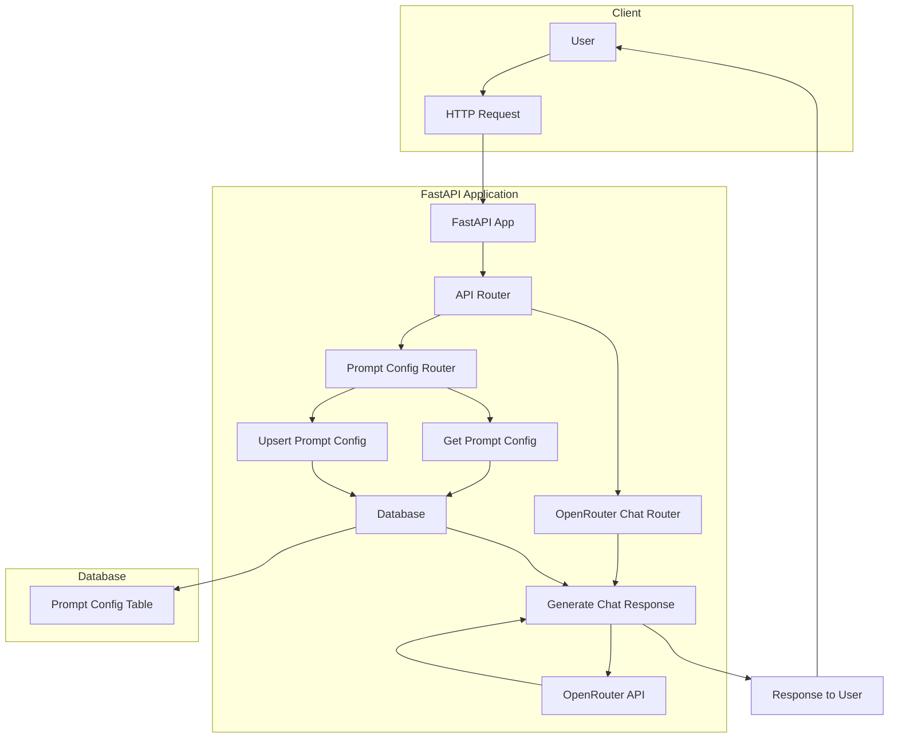

# Project Flow Chart

## Data Flow Description

1. **User Request Flow**:
   - User sends a request to the FastAPI application
   - Request is routed to the appropriate endpoint (Prompt Config or Chat)

2. **Prompt Configuration Flow**:
   - GET `/prompt-config/{feature}`: Retrieves prompt configuration for a specific feature
   - POST `/prompt-config/`: Creates or updates a prompt configuration
   - Configurations are stored in the database

3. **Chat Generation Flow**:
   - POST `/chat/generate`: Processes chat requests
   - Retrieves relevant prompt configuration from database (if needed)
   - Sends request to OpenRouter API with appropriate parameters
   - Returns AI-generated response to the user

## Data Models

### PromptConfig
- `feature`: String (Primary Key) - e.g., "guest_chat"
- `system_prompt`: Text (Optional)
- `model`: String - Default: "openrouter/gemma-7b"
- `temperature`: Float - Default: 0.7
- `top_p`: Float - Default: 1.0
- `max_tokens`: Float - Default: 500

### ChatRequest
- `user_id`: String
- `feature`: String
- `last_messages`: List of Strings
- `model`: String
- `temperature`: Float
- `system_prompt`: String
- `user_prompt`: String

### ChatResponse
- `response`: String
